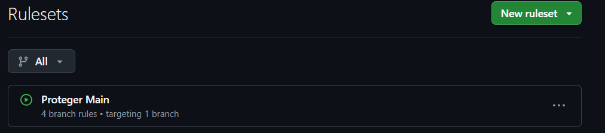

# Currículo Online - Projeto DS881

Projeto individual demonstrando conteinerização, automação de pipeline CI/CD e governança de código.

## 🔗 Link em Produção
**Acesse o currículo:** 
   https://annaluiza29.github.io/ds881-curriculo-GRR20242557/

## 🚀 Como executar o ambiente local (Docker)

Certifique-se de ter o **Docker** e o **Docker Compose** instalados na sua máquina.

1. No terminal, execute o comando:
   ```bash
   git clone https://github.com/annaluiza29/ds881-curriculo-GRR20242557.git

2. Na raiz do projeto, execute o comando:
   ```bash
   docker-compose up --build

3. Acesse a URL: 
   ```bash
   http://localhost:8080/


## Descrição da Configuração de Proteção da Branch `main`

A governança e integridade da branch principal deste repositório são asseguradas por uma regra de proteção estrita integrada via **GitHub Rulesets**, denominada **"Proteger Main"**, configurada com status ativo (`active`) e aplicando-se exclusivamente à branch `refs/heads/main`.

As seguintes restrições de segurança automatizadas e critérios de integração foram estabelecidos:

* **Bloqueio de Modificações Diretas (Restrições de Deleção e Escrita):** * É estritamente proibido deletar a branch `main` (`deletion`).
    * Estão desabilitados os *force pushes* (`non_fast_forward`), garantindo que o histórico de commits nunca seja sobrescrito de forma destrutiva.
* **Integração por Fluxo de Trabalho (Pull Request Obrigatório):**
    * Fica proibido o envio de código diretamente à branch principal via `git push`. Toda e qualquer alteração deve ser submetida por meio de um **Pull Request (PR)** (`pull_request`).
* **Validação Automatizada por Status Checks (CI/CD):**
    * O critério para permitir o merge de um Pull Request na branch `main` exige obrigatoriamente o sucesso do pipeline de Integração Contínua.
    * O gatilho de validação está atrelado ao Job **`lint-and-build`** configurado via GitHub Actions. Se os testes de padronização de sintaxe (Linter) ou a compilação (Build) falharem, o botão de merge será bloqueado nativamente pelo GitHub.
* **Isenções e Atores de Bypass:**
    * Nenhum usuário, administrador ou bot possui permissão especial para ignorar as regras descritas (`bypass_actors: []`), aplicando o princípio de governança horizontal a todos os envolvidos no ecossistema de desenvolvimento.

